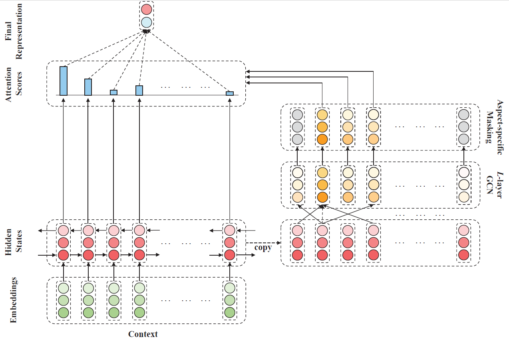

# ASGCN

---

## Aspect-Specific Graph Convolutional Network

* EMNLP 2019.
* It builds a Graph Convolutional Network (GCN) over the dependency tree of a sentence to exploit syntactical information and word dependencies. Based on it, a novel aspect specific sentiment classification framework is raised.
* For more information, please go to [ASGCN](https://github.com/GeneZC/ASGCN)
