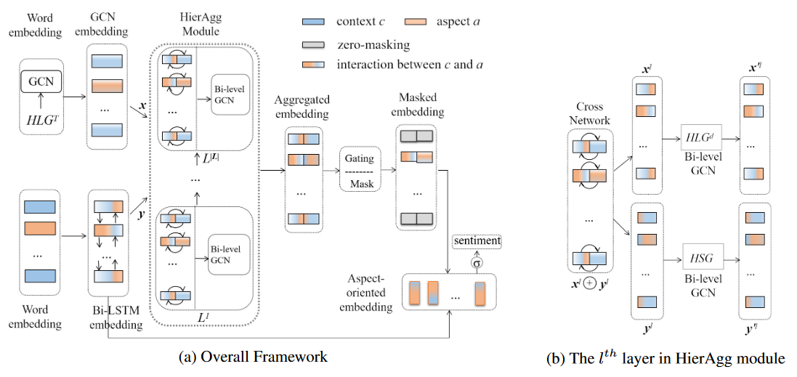

# BiGCN

---

## Bi-level Interactive Graph Convolution Network

* EMNLP 2020.
* It employs a global lexical graph to encode the corpus level word co-occurrence information. Then, it builds a concept hierarchy on both the syntactic and lexical graphs for differentiating various types of dependency relations or lexical word pairs. Finally, it designs a bi-level interactive graph convolution network to fully exploit these two graphs.
* For more information, please go to [BiGCN](https://github.com/NLPWM-WHU/BiGCN).

